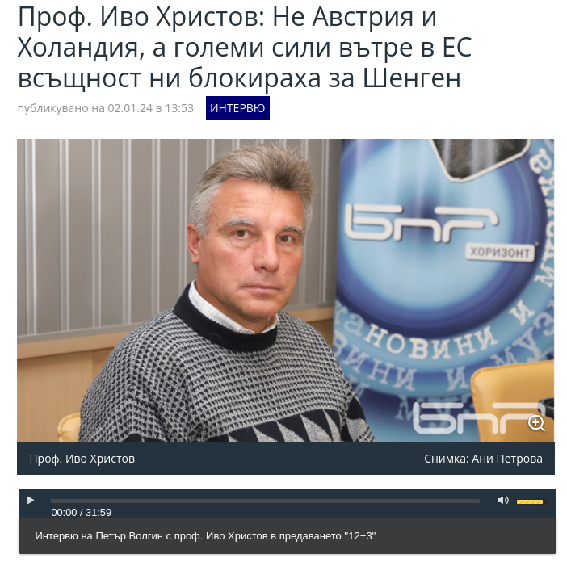
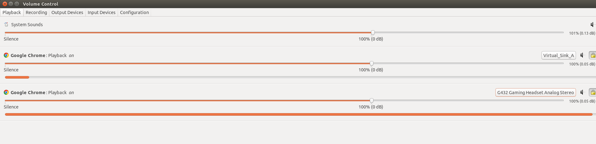

# Record, Transcribe and create static Videos from arbitrary audio streams

This guide provides instructions on how to record audio from any browser tab or player in Linux using PulseAudio tools. It covers creating a virtual audio sink, routing an audio stream to the sink and recording it, with the option to listen in through a physical output device.

## Prerequisites
Linux distribution with PulseAudio (e.g., Ubuntu 20.04).
Installed packages:  `pulseaudio, pavucontrol, parec, lame, and optionally ffmpeg`.
Basic understanding of command-line operations.

## Steps
1. Install Necessary Tools
Ensure you have PulseAudio and other required tools installed:

```shell
sudo apt-get install pulseaudio pavucontrol parec lame
```

If you plan to use `ffmpeg`, install it as well:

```shell
sudo apt-get install ffmpeg
```
## 2. Create a Virtual Sink
A virtual sink acts as a virtual audio device to which audio can be routed.

To create a virtual sink, use the following command:

```shell
pactl load-module module-null-sink sink_name=VI-A sink_properties=device.description="Virtual_Sink_A"
```

This command creates a virtual sink named VI-A.

## 3. Optional: Add a Loopback to Physical Transducer
If you want to listen to the stream through headphones or speakers while recording:

Create a loopback from the virtual sink to your physical output device:

```shell
pactl load-module module-loopback source=VI-A.monitor sink=SINK_NAME
```
You can find the name of your headphones sink (output device) by listing the sinks:

```shell
pactl list short sinks
```

Adjust the loopback module to route audio to your preferred output device using `pavucontrol`.

## 4. Route Audio to the Virtual Sink
Open `pavucontrol` and go to the "Playback" tab.
Find the stream (e.g., from a browser tab) you want to record.
Change the output device for that stream to your virtual sink (VI-A).

## 5. Record the Audio
To record the audio, use either `parec` and `lame`:

```shell
parec -d VI-A.monitor | lame -r -V0 - output.mp3
```

Or use ffmpeg (if installed with PulseAudio support):

```shell
ffmpeg -f pulse -i VI-A -acodec mp3 output.mp3
```

Replace output.mp3 with your desired file name.

## 6. Stop Recording
The recording can be stopped manually or by using a script that monitors the sink's state and stops recording when the stream ends (see below `recorder.sh`)

# `recorder.sh` - script Features


To use the `recorder.sh` script, follow Step 2 from above, by creating a virtual sink with a desired name.

```shell
pactl load-module module-null-sink sink_name=VI-A sink_properties=device.description="Virtual_Sink_A"
```

Optionally follow Step 3 and add a loopback to a physical device, in case you want to also listen to the stream while it's been recorded.

```shell
pactl list short sinks
9	alsa_output.pci-0000_02_00.1.hdmi-stereo-extra2	module-alsa-card.c	s16le 2ch 44100Hz	SUSPENDED
10	alsa_output.pci-0000_00_1b.0.analog-stereo	module-alsa-card.c	s16le 2ch 44100Hz	RUNNING
13	alsa_output.usb-Logitech_G432_Gaming_Headset_000000000000-00.analog-stereo	module-alsa-card.c	s16le 2ch 44100Hz	SUSPENDED
14	VI-A	module-null-sink.c	s16le 2ch 44100Hz	IDLE
```
Here my virtual sink is visible as the last device and I want create a loopback towards my speakers (`alsa_output.pci-0000_00_1b.0.analog-stereo`).

```shell
pactl load-module module-loopback source=VI-A.monitor sink=alsa_output.pci-0000_00_1b.0.analog-stereo
```

I will then start up any audio player from the web, in this case the following URL: https://bnr.bg/horizont/post/101929370/prof-ivo-hristov-ne-avstria-i-holandia-a-golemi-sili-v-es-vsashtnost-ni-blokiraha-za-shengen



which, when inspecting the source code leads us to the stream url: https://stream.bnr.bg/storage/Horizont/Actualni_2024/01/0201hristov.mp3

*NOTE: In this case we could go directly downloading the easily available mp3 file, however we might want to have a method to download from any arbitrary stream, where the stream URL will not be as easily accessible or be intentionally concealed for whatever reason.*

So, we press play on the given player and open up `pavcontrol` via the command line. The newly started stream is routed by default to our current default sink (Gaming headset). We choose the newly created virtual sink (`VI-A`). We now press pause on the player and restart the stream.



After this is done, trigger the recording script by feeding it with the virtual sink name and an output file name and press play, so that the recording will be initiated.

```shell
./recorder.sh VI-A test-output.mp3
```

After the recording ends, the script will detect no data flowing through and end by itself after a couple seconds.

# `transcribe.sh` - Automated Speech Recognition and Video Creation (using `whisper` and `ffmpeg`)

Once we have the audio stream recorded, we can attempt to perform speech to text via `whisper` following which we create a `.mp4` output file for direct youtube upload, or other consumption, depending what licensing allows.

In order to create the video from a static image, we need to additionally download the image supplying context ot the audio stream.

*NOTE: Follow licenses of all your sources to avoid legal issues.*

# Example videos (source info available at the video detail info):

Videos are created on a Ubuntu 20.04 machine with a RTX 3060ti card (8GB vram) with the medium size whisper model. The transcription and video creation takes roughly the same amount as the audio's length.

1. https://youtu.be/LTExalAYiBA?si=5XHZezbWmPescxGY
2. https://youtu.be/vRb-vMrujtY?si=ihv-Xrur7-UZt9G1
3. https://youtu.be/sFgclShqvVw?si=oS-hg_SMlJ5N7VSF


